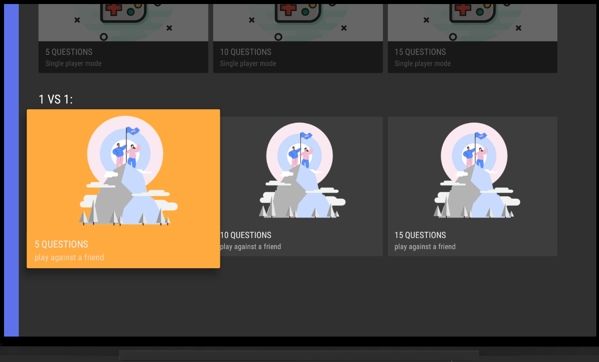

<h1 align=center>Android-TV-application</h1>  
Prototype of an application based on the Android TV platform.

## Abstract
The prototype created is a quiz game, in which questions are asked to be answered correctly. The user can choose one of the following two game modes:

•  <strong>Single player:</strong> You can play alone on your TV. The user is asked a series of questions and, for each of them, he must select, among the three options proposed, the one he deems correct. Only at the end of the game, after having answered all the questions, the user gets a score based on the correct answers given during the game.

•  <strong>Two Players:</strong>  You can play on the same TV with someone else. Players are asked the same number of questions and, as with the previous mode, the answer options are three, but the right one is only one.

For each of the two modes there are three types of challenges:

• game with five questions  
• game with ten questions  
• game with fifteen questions  

## Development
The application was developed using four Activities:

• [MainActivity](https://github.com/LucaBerardi6/Android-TV-application/blob/main/AndroidTVApp/app/src/main/java/com/example/lucaberardi/MainActivity.java): the launch Activity which represents the main screen of the application where it is possible to choose the game mode and the type of challenge.
The [MainFragment](https://github.com/LucaBerardi6/Android-TV-application/blob/main/AndroidTVApp/app/src/main/java/com/example/lucaberardi/MainFragment.java) class is used to create the layout.
The [CardPresenter](https://github.com/LucaBerardi6/Android-TV-application/blob/main/AndroidTVApp/app/src/main/java/com/example/lucaberardi/CardPresenter.java) class was used to create each of the home cards. With this class it is possible to create a View associated with the game mode.

• [GameActivity](https://github.com/LucaBerardi6/Android-TV-application/blob/main/AndroidTVApp/app/src/main/java/com/example/lucaberardi/GameActivity.java): the Activity that represents the game screen. The user interacts with the application by answering the questions, selecting the option he deems correct.

• [NextActivity](https://github.com/LucaBerardi6/Android-TV-application/blob/main/AndroidTVApp/app/src/main/java/com/example/lucaberardi/NextActivity.java): the Activity used when the challenge between two players is chosen. The second player is invited to prepare, as he is about to start his turn.

• [EndActivity](https://github.com/LucaBerardi6/Android-TV-application/blob/main/AndroidTVApp/app/src/main/java/com/example/lucaberardi/EndActivity.java): the Activity used at the end of each game. The outcome of the game is displayed on the user interface and it is possible to start the MainActivity to play a new game.

The [Question](https://github.com/LucaBerardi6/Android-TV-application/blob/main/AndroidTVApp/app/src/main/java/com/example/lucaberardi/Question.java) class has been created with which it is possible to associate its correct answer and its incorrect answers to a question. A Question object consists of five variables: the question, the correct answer, and the three possible answers.
A game mode is represented by a [Mode](https://github.com/LucaBerardi6/Android-TV-application/blob/main/AndroidTVApp/app/src/main/java/com/example/lucaberardi/Mode.java) object. A Mode object consists of a set of variables that are:
a title that identifies the type of challenge, a description, the number of players, the number of questions, an image.
A Mode is used in conjunction with the CardPresenter class to create the cards visible on the main screen that represent a given challenge for a specific game mode.

## Sample video of the app

https://user-images.githubusercontent.com/101281201/203586041-b4ca2c10-f166-44a5-b17f-4131795ca478.mp4

## Screenshots of the app
Some screenshots from the app (to see other screenshots go to the dir [Images](https://github.com/LucaBerardi6/Android-TV-application/tree/main/Images)):

   
  

    
  

    

    
  

   
 

   
 

   

## Other details
Dark backgrounds have been used and a light gray color has been chosen for most of the text, so as not to create difficulties for the user in reading and viewing the elements. In addition, for better processing, the text is always divided into small parts.
Each element has been made to a size that allows the user to see it properly at a distance of three meters and has been positioned to be easily reached, thus creating a coherent navigation for a TV device.
All the layouts have been created with a horizontal orientation and, in addition to the resources available in the [AndroidX Leanback](https://developer.android.com/reference/androidx/leanback/app/package-summary.html) library, RelativeLayout and LinearLayout have been used exclusively to create the View containers, so as to adapt the layout to the different characteristics of the television screens.

## Bibliograpy
- [Android](https://www.android.com/)
- [Android TV](https://developer.android.com/training/tv)
- [Android Developers](https://developer.android.com/)
- [Androidx Leanback](https://developer.android.com/reference/androidx/leanback/app/package-summary)
